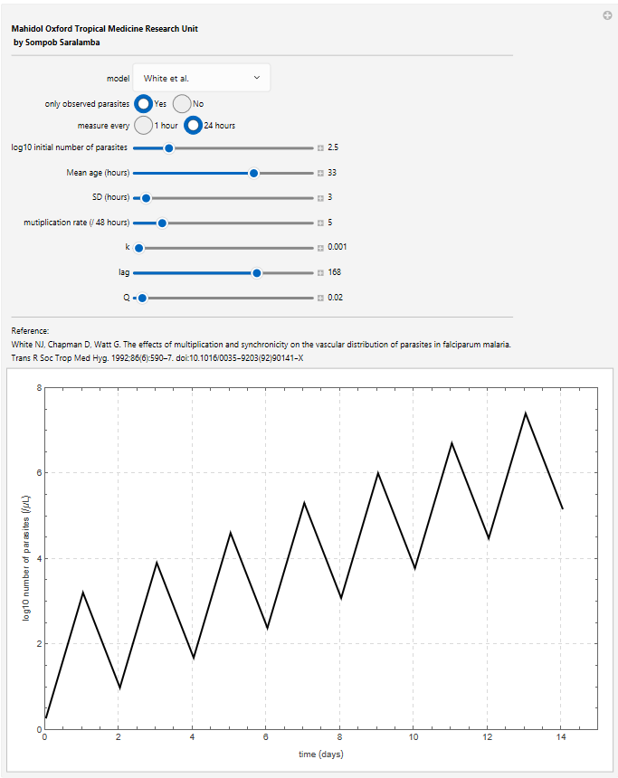

# ExpansionPhase

Code accompanying the manuscript:

> **The dynamics of *Plasmodium falciparum* during the expansion phase of the asexual stage of infection**

This repository contains the mathematical models, Bayesian inference code, and figures used in the manuscript.

The project extends the age-structured within-host model of White et al. by incorporating growth-limiting mechanisms acting on merozoites and asexual blood-stage parasites. The models were fitted to historical *Plasmodium falciparum* malariotherapy data using Stan, and interactive Wolfram notebooks are provided to allow users to explore the effects of model parameters. :contentReference[oaicite:1]{index=1}

---

## Repository structure

```
ExpansionPhase/
├── Figures/
├── Stan/
├── Wolfram/
└── README.md
```

### 📁 Wolfram

This folder contains interactive Wolfram Mathematica notebooks for both models:

- **Original model** (White et al.)
- **Extended model** incorporating growth-limiting factors

The notebooks use Mathematica's `Manipulate` function, allowing users to modify parameter values using sliders and immediately visualize how the predicted parasite dynamics change.




---

### 📁 Stan

This folder contains the Stan codes used for Bayesian parameter estimation.

File naming convention:

- **NJW*** – Original age-structured model
- **NJWQ*** – Extended model including growth-limiting factors

These Stan models were used for individual-level and hierarchical population-level model fitting described in the manuscript.

---

### 📁 Figures

This folder contains the figures presented in the manuscript.

These include illustrations of:

- observed parasite trajectories,
- representative model fits,
- parameter distributions,
- population-level model predictions,
- and other publication figures.

---

## Software requirements

### Wolfram Mathematica

To explore the interactive models:

- Wolfram Mathematica (Version 12 or later recommended)

### Stan

To reproduce the Bayesian model fitting, any Stan interface may be used, including:

- CmdStan
- CmdStanR
- RStan

---

## Models

Two within-host models are included.

### Original model

The original age-structured model of White et al. describing the within-host dynamics of asexual *Plasmodium falciparum* parasites.

### Extended model

An extension of the original model incorporating growth-limiting mechanisms through:

- a delayed reduction in parasite multiplication,
- continuous removal of asexual blood-stage parasites.

The extended model was developed to reproduce parasite trajectories exhibiting sustained growth, plateauing, or declining parasite densities during the expansion phase.

---

## Citation

If you use this repository, please cite:

> **Sompob Saralamba**
>
> *The dynamics of Plasmodium falciparum during the expansion phase of the asexual stage of infection.*
>
> *(Update with journal information once published.)*

---

## Contact

For questions regarding the code or the models, please contact:

**Sompob Saralamba**  
Mahidol Oxford Tropical Medicine Research Unit  
Email: sompob@tropmedres.ac
---

## License

This repository is released under the MIT License.

